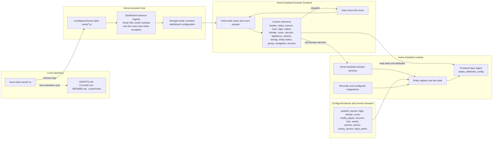

## Project Overview

- **Project Name:** Home Dark Cards
- **Description:** This repository contains sixteen standalone JavaScript custom cards
  for a Home Assistant Lovelace dashboard named `home-dark`. The cards execute in
  the Home Assistant browser frontend, read entity state from the frontend `hass`
  object, render responsive dashboard controls, dispatch Home Assistant
  `hass-more-info` events, and call Home Assistant domain services. The repository
  is not a standalone web application and does not contain a server, local Home
  Assistant configuration, database, generated bundle, package manifest, or build
  system.
- **Main Features:**
  - `home-header-card`: Clock, localized date, current weather, humidity,
    apparent temperature, and optional daily forecasts retrieved through
    `weather.get_forecasts`.
  - `home-status-card`: House-mode selection plus PM2.5, PM10, and optional air
    quality metrics.
  - `home-person-card`: Person presence, avatar, location, optional battery, and
    optional distance from `zone.home`.
  - `home-room-tile-card`: Room summary, climate readings, configured domain
    icons, light status, and optional popup-hash navigation.
  - `home-light-card`: Single-light toggle and touch/keyboard brightness control
    when the live light exposes a non-`onoff` supported color mode.
  - `home-climate-card`: Capability-driven HVAC menus, temperature and humidity
    steppers, configurable switch power control, and native climate power
    fallback when the live entity exposes both required capability bits.
  - `home-vacuum-card`: Roborock controls, live map, status metrics, alerts, and
    collapsible configuration sections.
  - `home-door-security-card`: Doorbell camera preview, ring and door status,
    silent-mode switch, lock control, lock battery text, and optional lock
    confirmation.
  - `home-cover-card`: Capability-aware dark controls for blinds and shutters,
    including open, stop, close, position, discrete slat-tilt actions at 0%, 25%,
    75%, and 100%, and shutter light-position actions.
  - `home-entity-status-card`: Configurable numeric and binary entity metrics
    with proportional status dots and more-info actions.
  - `home-energy-overview-card`: Daily energy-use and cost summary.
  - `home-switch-card`: Switch-like entity control with configurable actions
    and compact or tall layouts.
  - `home-group-card`: Expandable container for nested Lovelace cards.
  - `home-floating-menu-card`: Fixed bottom navigation for dashboard views.
  - `home-appliance-card`: Expandable Home Connect appliance state, program,
    progress, power, and option controls.
  - `home-camera-grid-card`: Grouped camera snapshots with native camera
    more-info actions.

---

## Architecture Overview

The repository uses a client-side custom-card architecture. Home Assistant hosts
the JavaScript files as external module resources and instantiates a card when a
dashboard card uses the matching `custom:` type. Home Assistant supplies entity
state, configuration, and service APIs through the frontend `hass` object.

There is no repository-owned backend or data-access layer. The local source files
are the presentation and interaction layer; Home Assistant owns dashboard
configuration, resource registration, entity state, service execution, and
persistence.

- **Design Patterns/Principles:**
  - Native browser Custom Elements implemented by extending `HTMLElement`.
  - Home Assistant Lovelace card lifecycle methods: `setConfig`, `set hass`,
    `getCardSize`, and, on applicable cards, `getGridOptions`.
  - Configuration-driven rendering: entity IDs and display options come from the
    dashboard card configuration.
  - Event-driven controls using DOM events, `hass-more-info`, and Home Assistant
    service calls.
  - Shadow DOM encapsulation in `home-status-card`, `home-person-card`, and
    `home-door-security-card`; the other cards render in light DOM.
  - Inline CSS with responsive media queries and Home Assistant theme-variable
    fallbacks.
  - State and persistence remain in Home Assistant; the repository has no
    application-wide store or persistent local data layer.

### System Diagram

- **Diagram:**



- **Explanation:**
  - The README documents manual copying of a JavaScript file to
    `/config/www/home-dark-cards/` on the Home Assistant host.
  - The matching `/local/home-dark-cards/*.js` URL is registered as an external
    JavaScript module resource in Home Assistant.
  - Local Home Dark card sources are deployed as URL-mode modules under
    `/local/home-dark-cards/`, except `home-cover-card`, which remains the
    separately managed inline-resource exception.
  - The `home-dark` dashboard references the registered resources with
    `custom:<card-type>` cards. The README records six dashboard views and ten
    room popups for the current dashboard configuration.
  - Cards read `hass.states[entity_id]` and selected attributes. Interactive
    controls call services with `entity_id`.
  - More-info interactions dispatch the native `hass-more-info` event; Home
    Assistant handles the resulting dialog.
  - The repository does not identify a vendor implementation behind every
    configured Home Assistant entity. It documents only entities and
    integrations recorded in the repository documentation.

---

## Front End/Client Side

- **UI**

  This is a Home Assistant Lovelace custom-card set, not a standalone frontend
  with application pages or a client router. The repository documentation
  records these `home-dark` views:

  - **Home:** Header, house status, person cards, ten room tiles, door security,
    Tesla-style energy flow, vacuum/Tesla quick rows, and ten room popups.
  - **Lights:** Per-room light controls.
  - **Climate:** Eight climate entities in the primary view:
    `climate.living_room`, `climate.cinema`, `climate.office_ac`,
    `climate.erics_room`, `climate.master_bedroom`,
    `climate.master_bathroom`, `climate.erics_bathroom`, and
    `climate.studio_bathroom`.
  - **Blinds:** Configured room cover controls.
  - **Media:** Media-player rows for Living Room, Cinema, and Office.
  - **Vacuum:** Roborock control row.

  The same context records two dashboard configurations outside this local card
  set: `mobile-home` with native sections/tile cards and views for Home, Lights,
  Climate, Security, Storm Trooper, and Media; and `home-design`, a single-panel
  dashboard using `custom:home-dashboard-card`. Their full configuration is
  remote and is not stored in this repository.

  Cross-cutting frontend behavior is provided by Home Assistant. The source
  contains no login screen, token storage, client router, API gateway,
  application-wide state library, or separate API client. Access to state and
  service execution relies on the already authenticated Home Assistant frontend
  context.

- **Structure**

  Each source file contains one custom-element class, configuration validation,
  state/attribute helpers, rendering, event handling, inline CSS, and
  `window.customCards` picker metadata.

  - `home-header-card.js`: Clock refresh, current-weather rendering, optional
    forecast request, in-memory forecast cache, and 30-minute forecast refresh
    limit.
  - `home-status-card.js`: Shadow DOM house-mode selector, validation against
    `input_select` options, metric formatting, display-only air-quality bands,
    and metric more-info actions.
  - `home-person-card.js`: Shadow DOM presence card, person/sensor validation,
    optional battery display, proximity calculation, and accessible more-info
    control.
  - `home-room-tile-card.js`: Room summary rendering, temperature-unit
    resolution, optional popup hash, and more-info fallback.
  - `home-light-card.js`: Dimmability detection, pointer and keyboard brightness
    preview, one brightness service call per completed interaction, and pending
    state reconciliation.
  - `home-climate-card.js`: Dynamic control generation from live climate
    attributes, native mode menus, target steppers, power capability detection,
    optimistic pending values, and viewport-aware menus.
  - `home-vacuum-card.js`: Roborock actions, map, metric formatting, alerts, and
    collapsible sections.
  - `home-cover-card.js`: Shadow DOM cover controls, capability detection, position
    slider, discrete slat-tilt actions, editor form, and error feedback.
  - `home-door-security-card.js`: Shadow DOM camera and lock UI, camera fallback,
    lock and silent-mode service calls, and optional confirmation dialog.
  - `home-entity-status-card.js`: Numeric and binary metric formatting,
    proportional status dots, and metric more-info actions.
  - `home-energy-overview-card.js`: Daily energy and cost item calculation.
  - `home-switch-card.js`: Switch-like controls, configurable actions, state
    content, and grid-aware layouts.
  - `home-group-card.js`: Expandable child-card creation through Home
    Assistant card helpers.
  - `home-floating-menu-card.js`: Fixed navigation, active-path resolution,
    and safe-area-aware positioning.
  - `home-appliance-card.js`: Appliance operation, progress, program,
    power, stop, and option controls.
  - `home-camera-grid-card.js`: Grouped camera snapshots, availability state,
    and camera more-info actions.

---

## Back End/Service Side

- **Bootstrap**

  No repository-owned server starts. Each JavaScript module registers a browser
  custom element with `customElements.define(...)` and registers card picker
  metadata in `window.customCards`. Home Assistant loads the module when the
  corresponding dashboard resource and `custom:` card are configured.

- **Contract**

  The source implements the Home Assistant Lovelace custom-card contract:

  - `setConfig(config)`: Receives and validates dashboard card configuration.
  - `set hass(hass)`: Receives the Home Assistant frontend object and triggers
    state-based rendering.
  - `getCardSize()`: Reports preferred card height.
  - `getGridOptions()`: Present on cards that provide sections-view sizing.
  - `getConfigElement()` and `getStubConfig()`: Present on
    `home-cover-card.js` for dashboard-editor support.
  - `hass-more-info`: Bubbling, composed event requesting the native more-info
    dialog.

  Domain service calls directly present in the JavaScript source are:

  - `weather.get_forecasts`
  - `input_select.select_option`
  - `light.toggle` and `light.turn_on` with `brightness_pct`
  - `climate.set_hvac_mode`, `set_temperature`, `set_humidity`,
    `set_fan_mode`, `set_preset_mode`, `set_swing_mode`,
    `set_swing_horizontal_mode`, `turn_on`, and `turn_off`
  - `cover.open_cover`, `stop_cover`, `close_cover`, `set_cover_position`, and
    `set_cover_tilt_position`
  - `media_player.media_play_pause`
  - `vacuum.start` and `vacuum.return_to_base`
  - `lock.lock` and `lock.unlock`
  - `switch.turn_on` and `switch.turn_off`

  `home-header-card.js` can obtain the weather response through
  `hass.callService`, `hass.callWS`, or
  `hass.connection.sendMessagePromise`. The source contains no repository-owned
  HTTP, REST, GraphQL, gRPC, or WebSocket server endpoint.

- **App Layers**

  - **Presentation:** Custom-element DOM, `ha-card`, `ha-icon`, Shadow DOM where
    used, and inline CSS.
  - **State access:** Card-local helpers read `hass.states[entity_id]` and
    selected attributes.
  - **Interaction:** Click, pointer, keyboard, focus, scroll, resize, and
    window-blur handlers translate UI actions into more-info events or service
    calls.
  - **Data and persistence:** Home Assistant owns entity state, service
    execution, dashboard configuration, and resource registration.
  - **DAL:** No repository data-access layer exists. State access is through the
    Home Assistant frontend object.

- **Infra**

  Runtime dependencies evidenced by the source are Home Assistant frontend
  primitives and APIs: `ha-card`, `ha-icon`, `hass.states`, `hass.config`,
  `hass.callService`, and the optional Home Assistant WebSocket methods described
  above. No package manifest, lockfile, compiler, bundler, server configuration,
  database client, environment loader, logging framework, or CI workflow exists
  in the repository.

- **3rd Parties**

  - **Home Assistant:** Dashboard host, state provider, service executor,
    resource registry, and more-info handler.
  - **Home Assistant weather service:** Forecast retrieval uses
    `weather.get_forecasts`; the repository does not identify the underlying
    weather vendor for that entity.
  - **Material Design Icons:** `mdi:*` names are rendered through Home
    Assistant's `ha-icon`; no icon package is bundled.
  - **Bubble Card and HACS card resources:** The project context records Bubble
    Card and other HACS cards in the remote dashboard configuration; their source
    is not in this repository.
  - **Remote Home Assistant integrations recorded in project context:** Airly,
    Daikin Onecta (OAuth2), HACS, Supervisor/hassio, core, Lovelace, network,
    and recorder.
  - **Remote Home Assistant Apps recorded in project context:** Music Assistant,
    Terminal & SSH, ZigStar TI CC2652P/P7 FW Flasher, Mosquitto broker, YT Music
    PO Token Generator, ESPHome Device Builder, Studio Code Server, Zigbee2MQTT,
    RPC Shutdown, Samba share, chrony, Everything Presence Zone Configurator,
    Piper (TTS), Whisper (STT), and Home Assistant MCP Server.

---

## Technology Stack

The repository does not declare a JavaScript runtime version or package
dependency versions. Two recorded Home Assistant versions must be kept distinct:
the `home-dark-cards/README.md` export metadata says Home Assistant Core
`2026.7.4` for an export made on 2026-08-01, while `AGENTS.md` and `CLAUDE.md`
record the connected installation as Home Assistant Core `2026.7.3`.

- **Frontend:**
  - Frameworks/Libraries: Native browser Custom Elements and Home Assistant
    Lovelace custom-card APIs.
  - Language: JavaScript; language/runtime version [Information not found in
    codebase].
  - Styling: Inline CSS, responsive media queries, CSS custom properties, and
    Home Assistant theme-variable fallbacks.
  - State Management: Home Assistant's `hass` object; no state-management
    library is present.

- **Backend:**
  - Language/Framework: No repository-owned backend language or framework.
  - API: Home Assistant Lovelace lifecycle, frontend state object, event contract,
    and domain service APIs.

- **Database:**
  - Primary Database: The local repository contains no database configuration.
    Project context records a remote Home Assistant recorder database using
    MySQL/MariaDB, approximately 3.2 GB, with oldest recorded run 2026-07-11.
  - Cache: No external cache. `home-header-card` uses an in-memory forecast cache
    on each card instance.

- **Other Tools & Services:**
  - Home Assistant Core: `2026.7.3` in project context; `2026.7.4` in the
    README export metadata as described above.
  - Home Assistant OS: `18.1` in project context.
  - HACS: `2.0.5` and 28 downloaded custom repositories in project context.
  - Virtualization: KVM VM with board `ova` in project context.
  - Containerization: [Information not found in codebase].
  - Message Queue: [Information not found in codebase].
  - Search: [Information not found in codebase].
  - CI/CD: [Information not found in codebase].

---

## Project Structure

```plaintext
ha_custom_cards_set/
├── home-dark-cards/
│   ├── home-header-card.js         # Clock, weather, and forecast card
│   ├── home-status-card.js         # House mode and air-quality card
│   ├── home-person-card.js         # Person presence card
│   ├── home-room-tile-card.js      # Room summary and popup navigation
│   ├── home-light-card.js          # Standalone light control row
│   ├── home-climate-card.js        # Standalone climate control card
│   ├── home-vacuum-card.js         # Roborock controls, map, and status
│   ├── home-cover-card.js          # Blinds and shutters control card
│   ├── home-door-security-card.js  # Doorbell and lock card
│   ├── home-entity-status-card.js   # Numeric and binary status metrics
│   ├── home-energy-overview-card.js # Daily energy and cost summary
│   ├── home-switch-card.js          # Switch-like entity control
│   ├── home-group-card.js           # Expandable nested-card container
│   ├── home-floating-menu-card.js   # Fixed dashboard navigation
│   ├── home-appliance-card.js       # Home Connect appliance control
│   ├── home-camera-grid-card.js     # Grouped camera snapshots
│   └── README.md                   # Card contracts and deployment notes
├── .cursor/
│   └── rules/
│       ├── home-assistant-best-practices.mdc
│       └── home-assistant/references/ # Automation, dashboard, helper, and
│                                      # device-control guidance
├── .claude/
│   └── settings.local.json         # Claude permissions and enabled plugin
├── AGENTS.md                       # Cursor project context and remote snapshot
├── CLAUDE.md                       # Mirrored project context
├── README.md                       # Repository and skill documentation
├── .gitattributes                  # Text-file LF normalization rule
└── ai-overview.md                  # This onboarding document
```

The repository has no `src/`, `components/`, `pages/`, `services/`, `utils/`,
`models/`, `tests/`, `scripts/`, package manifest, lockfile, Dockerfile, or CI
workflow.

The README records these local card resource IDs:

| Source file | Card type | Resource ID |
|---|---|---|
| `home-header-card.js` | `home-header-card` | `f5ede969d4124ec89d4e76d2d2f4ecca` |
| `home-room-tile-card.js` | `home-room-tile-card` | `02af4e539e264967a4c8b7079075876e` |
| `home-vacuum-card.js` | `home-vacuum-card` | `3192edab42a1488192bc960c27807df7` |
| `home-light-card.js` | `home-light-card` | `376b336445804f819b97c6b461f530cb` |
| `home-person-card.js` | `home-person-card` | `d655ab1709e94df7be303b4504d5397c` |
| `home-door-security-card.js` | `home-door-security-card` | `fdf4fcf92eee4a61805911ed6fc8a781` |
| `home-status-card.js` | `home-status-card` | `aa8e713224b14feab81eb6aa0586560d` |
| `home-climate-card.js` | `home-climate-card` | `d3ddace99f314afbbbe9ad689d437161` |
| `home-cover-card.js` | `home-cover-card` | `264907031d174aae8eaf44caa4dab133` |
| `home-entity-status-card.js` | `home-entity-status-card` | `72bcc61a0f334c23912a28e272f5a6ef` |
| `home-floating-menu-card.js` | `home-floating-menu-card` | `f6e3ebca911144e2ab3dc847a082a31e` |
| `home-switch-card.js` | `home-switch-card` | `257d462671f14a0fba4d422931a99f2b` |
| `home-group-card.js` | `home-group-card` | `e0a94f1cc4cc4b9b95f828176e7c0a57` |
| `home-energy-overview-card.js` | `home-energy-overview-card` | `da52af5bbea0436d882c4261595b237e` |
| `home-appliance-card.js` | `home-appliance-card` | [Not recorded in this repository] |
| `home-camera-grid-card.js` | `home-camera-grid-card` | [Not recorded in this repository] |

---

## Environment Configurations

- **Environments:**
  - Development: [Information not found in codebase]
  - Staging: [Information not found in codebase]
  - Production: [Information not found in codebase]

- **Configuration Management:**
  - Card instance configuration is stored in the remote Home Assistant
    dashboard.
  - JavaScript resource URLs are stored in Home Assistant's dashboard resource
    registry as URL-mode modules. `home-cover-card` is the existing separately
    managed inline-resource exception.
  - The repository contains no `.env`, `.env.example`, environment loader, or
    application configuration schema.
  - Project context records the target Lovelace configuration as storage mode.
  - The project-context files say that actual entities, automations, scripts,
    scenes, helpers, dashboards, and other Home Assistant state live on the
    remote instance, not in this repository.

- **Setup Instructions for local development:**
  1. No package installation or build step is defined in the repository.
  2. For a URL-mode resource, copy the required JavaScript file to
     `/config/www/home-dark-cards/<card-file>.js` on the Home Assistant host.
  3. Register or update the matching URL-mode module resource at
     `/local/home-dark-cards/<card-file>.js`. `home-cover-card` is the
     separately managed inline-resource exception and must not be replaced by
     this workflow.
  4. Add or edit a manual `custom:<card-type>` card in the Home Assistant
     dashboard editor.
  5. Save the dashboard and hard-refresh the browser after copying or updating a
     resource.

The README explicitly states that this repository does not copy files to Home
Assistant or change the remote dashboard automatically.

---

## Security

- **Authentication:** [Information not found in codebase]. The source contains no
  login flow, token storage, or credential implementation. Cards rely on access
  already granted to the Home Assistant frontend.
- **Authorization:** [Information not found in codebase]. The cards define no
  roles or permission model. Home Assistant controls access to the dashboard and
  services.
- **Data Encryption:** [Information not found in codebase]. The repository does
  not configure transport encryption or at-rest encryption.
- **Security Tools:** [Information not found in codebase]. No security middleware,
  dependency manifest, rate limiter, or scanning workflow exists.
- **UI safety behavior:** `home-door-security-card` supports an in-card
  confirmation dialog for lock and unlock actions when `confirm_lock_actions` is
  enabled. `home-status-card` only submits a house-mode option that is present
  in the configured `input_select` entity. Card configuration validates required
  entity prefixes where implemented.

---

## Deployment

- **Deployment Process:**
  1. Copy changed card source files to
     `/config/www/home-dark-cards/`.
  2. Register or update the matching Home Assistant module resource at
     `/local/home-dark-cards/<card-file>.js`, retaining the documented resource
     ID when updating an existing card.
  3. Verify the resource registry and dashboard card references.
  4. Save the dashboard if its card configuration changed.
  5. Hard-refresh the browser or Companion app.

  The README states that resource registration does not upload files from this
  repository to `/config/www`; file copying remains a separate manual operation.

- **CI/CD Pipeline:** [Information not found in codebase]. No workflow or
  deployment automation is present.

- **Tools Used:**
  - Home Assistant `/config/www/home-dark-cards/` static directory.
  - Home Assistant `/local/home-dark-cards/*.js` module resources.
  - Home Assistant dashboard resource and dashboard configuration APIs.
  - Deployment scripts: [Information not found in codebase].

---

## Testing

- **Testing Frameworks:**
  - Unit Testing: [Information not found in codebase].
  - Integration Testing: [Information not found in codebase].
  - End-to-End Testing: [Information not found in codebase].

- **Running Tests:**
  - Formal test command: [Information not found in codebase].
  - JavaScript syntax verification: [Information not found in codebase].
  - Live verification consists of inspecting the Home Assistant resource
    registry, dashboard configuration, entity state, and service metadata.

- **Test Coverage:** [Information not found in codebase]. No test files,
  coverage configuration, or coverage report is present.

The project context records that the Home Assistant dashboard screenshot beta
feature is disabled on the verified instance, so visual validation is performed
through source, resource, configuration, entity-state, and service-metadata
checks rather than an instance screenshot.

---

## UI Framework

- **Framework/Library:** Native browser Web Components implemented with
  `HTMLElement`, following the Home Assistant Lovelace custom-card lifecycle.
- **Component Library:** Home Assistant frontend `ha-card` and `ha-icon`.
- **Styling:** Inline CSS with dark palette fallbacks, Home Assistant theme
  variables, responsive layout, touch controls, scrolling menus, and
  focus-visible states.
- **External UI package:** [Information not found in codebase]. No React, Vue,
  Angular, Lit, Material UI, Tailwind, or package dependency is declared.

---

## Shared Utilities and Helpers

- **Utilities:** No shared JavaScript utility module exists. State lookup,
  attribute lookup, formatting, escaping, service calls, and more-info event
  helpers are implemented within individual card files.
- **Card-local helpers:**
  - `home-header-card.js`: Forecast request fallback handling, forecast cache,
    date/time formatting, condition-to-icon mapping, and refresh scheduling.
  - `home-status-card.js`: Threshold validation, option validation, metric
    formatting, and display-only quality bands.
  - `home-person-card.js`: Entity validation, HTML escaping, presence mapping,
    battery validation, and geographic distance calculation.
  - `home-room-tile-card.js`: Temperature-unit resolution, HTML escaping, and
    popup-hash normalization.
  - `home-light-card.js`: Dimmability detection, pointer-to-value conversion,
    slider preview, service commit, and pending-slider reconciliation.
  - `home-climate-card.js`: Numeric rounding, field-specific pending
    reconciliation, mode menu creation, climate capability detection, and
    responsive menu positioning.
  - `home-cover-card.js`: HTML escaping, supported-feature detection, position
    clamping, cover command dispatch, discrete tilt-button dispatch, slider
    updates, and editor configuration conversion.
  - `home-door-security-card.js`: Lock confirmation state, camera fallback,
    door-status formatting, and silent-mode toggling.

- **Example native more-info event:**

```javascript
this.dispatchEvent(new CustomEvent('hass-more-info', {
  detail: { entityId: entity },
  bubbles: true,
  composed: true
}));
```

---

## Important Notes

- The repository contains card source, guidance, and documentation. Dashboard
  configuration, resource registration, entity state, automations, helpers,
  scripts, scenes, and device data live on the remote Home Assistant instance.
- The project context records a Home Assistant installation with 2,016 entities
  across 42 domains, 375 services, 14 areas, 74 automations, two scripts, and
  no dedicated scenes found in its top-level scan. These values are recorded
  remote-instance context, not local configuration files.
- The largest entity domains recorded in project context are `sensor` (645),
  `binary_sensor` (303), `number` (233), `switch` (202), `select` (100),
  `update` (89), `button` (79), `light` (78), `media_player` (39),
  `device_tracker` (30), `climate` (13), and `cover` (11).
- The 14 recorded areas are Apartment, Cinema, Eric's Bathroom, Eric's Room,
  Hallway, Kitchen, Laundry, Living Room, Master Bathroom, Master Bedroom
  (area ID `bedroom`), Office, Studio, Studio Bathroom, and Garage. No floors
  are defined.
- Recorded notable remote systems include Zigbee through Zigbee2MQTT and a
  ZigStar coordinator, KNX, Zigbee/Wi-Fi devices, Shelly power monitoring and
  switching, Daikin Onecta climate, KNX-driven heating, Cinema media devices,
  Roborock, Music Assistant, front-door security, doorbell entities, exterior
  sirens, and house-mode automation through `input_select.house_mode`.
- Recorded energy entities include the `min_max` helper
  `sensor.whole_house_grid_power`, the Anker Solix C1000X sensors used by the
  Tesla-style energy-flow card, Tesla Wall Connector sensors, and
  `switch.storm_trooper_charge`. The repository does not contain these remote
  helper definitions.
- Remote dashboard details recorded in project context include the
  `mobile-home` dashboard, the `home-design` dashboard, and the modular
  `home-dark` card set. The HACS resources used by remote dashboards are not
  local source files.
- `home-light-card.js` is the independent light implementation.
- `home-climate-card.js` is split from room summaries:
  `home-room-tile-card.js` displays readings and navigates to a popup, while
  climate control behavior lives in the dedicated climate card.
- `home-climate-card.js` suppresses controls and service actions when the climate
  entity is `unknown` or `unavailable`.
- `home-cover-card.js` is the local source for separately managed inline
  resource `264907031d174aae8eaf44caa4dab133`.
- `show_tilt_buttons` defaults to `true` and is explicitly set on all six live
  cover-card configurations. The option applies to every room/entity in a card;
  setting it to `false` removes the tilt controls and unavailable notice.
- The project context records these known remote-instance limitations:
  `automation.turn_on_living_room_tv_wake_on_lan` is unavailable;
  `automation.master_bedroom_bed_light_copied` is recorded as a duplicate with
  live state off and its intended role is not documented; no floors are
  configured; and dashboard screenshots are unavailable because the screenshot
  beta feature is disabled.
- The repository has no formal automated test suite, package dependency
  manifest, CI/CD workflow, or repository-owned backend.
- No changes were made to the remote Home Assistant instance while producing this
  document.

---

### Maintenance Note

Update this document when a card source, configuration contract, supported
service call, resource ID or URL, dashboard usage, deployment path, or verified
Home Assistant project-context value changes. Keep runtime versions,
installation details, security claims, and operational procedures limited to
facts recorded in the repository or directly verified from Home Assistant.
