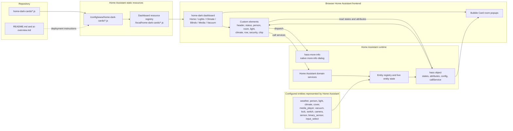

## Project Overview

- **Project Name:** Home Dark Cards
- **Description:** This repository contains standalone JavaScript custom cards for
  the Home Assistant `home-dark` Lovelace dashboard. The cards run in the
  browser, read Home Assistant state from the supplied `hass` object, render
  dashboard UI, dispatch native more-info events, and call Home Assistant
  services. The repository is not a standalone web application and contains no
  server, database, build output, or generated bundle.
- **Main Features:**
  - `home-header-card`: Clock, localized date, current weather, humidity,
    apparent temperature, and optional cached daily forecast.
  - `home-status-card`: House-mode selection plus PM2.5, PM10, and optional
    air-quality metrics.
  - `home-person-card`: Person presence, avatar, location, optional battery,
    and optional distance from `zone.home`.
  - `home-room-tile-card`: Room summary with configured domain icons,
    climate readings, and popup-hash navigation.
  - `home-light-card`: Theme-aware light toggle and optional brightness
    control.
  - `home-climate-card`: Dynamic climate summary, native mode menus,
    target-temperature and humidity steppers, configured switch power control,
    and capability-confirmed native climate power fallback.
  - `home-row-card`: Compatibility control row for lights, covers, media
    players, vacuums, and the Tesla quick-device summary.
  - `home-door-security-card`: Doorbell camera, ring and door status,
    silent-mode switch, lock control, battery text, and lock confirmation.
  - `home-chip-card`: Compact person, lock, light-group, or generic entity
    status chip. It is registered but has no current `home-dark` card instance.

---

## Architecture Overview

The project uses a client-side Home Assistant custom-card architecture. Home
Assistant loads each JavaScript file as an external module resource and creates
the corresponding browser custom element when a `custom:` card is present in
the dashboard. Home Assistant supplies entity state, configuration, and service
 APIs through the `hass` object.

- **Design Patterns/Principles:**
  - Native browser Custom Elements implemented with `HTMLElement`.
  - Home Assistant Lovelace card lifecycle: `setConfig`, `hass`,
    `getCardSize`, and optional `getGridOptions`.
  - Configuration-driven rendering; card instances receive entity IDs and
    display options from dashboard configuration.
  - Event-driven interaction through DOM events, `hass-more-info`, and
    Home Assistant service calls.
  - Shadow DOM encapsulation in `home-person-card`, `home-status-card`, and
    `home-door-security-card`; the remaining cards render into light DOM.
  - Inline CSS with responsive media queries and CSS custom-property theme
    fallbacks.
  - State and persistence remain in Home Assistant. The repository owns no
    application-wide store or persistence layer.

### System Diagram

- **Diagram:**



- **Explanation:**
  - A local source file is copied to
    `/config/www/home-dark-cards/` on the Home Assistant host.
  - A matching `/local/home-dark-cards/*.js` module URL is registered in
    Home Assistant's dashboard resource registry.
  - The `home-dark` dashboard references the registered resources through
    `custom:` card types. The live dashboard has six sections views and ten
    Bubble Card room popups.
  - Each card reads the current entity record from `hass.states` and selected
    attributes. Interactive controls call Home Assistant services with
    `entity_id`.
  - More-info rows dispatch `hass-more-info`; Home Assistant handles the
    resulting dialog.
  - The repository does not identify the vendor implementation behind every
    configured Home Assistant entity. It documents only entities verified in
    the dashboard or live Home Assistant responses.

---

## Front End/Client Side

- **UI**

  This is a Home Assistant Lovelace card set rather than a standalone frontend.
  The live `home-dark` dashboard contains these views:

  - **Home:** Header, home status, person cards, ten room tiles, door security,
    Tesla-style energy flow, vacuum/Tesla quick rows, and ten room popups.
  - **Lights:** Per-room light rows.
  - **Climate:** Eight climate-card instances for
    `climate.living_room`, `climate.cinema`, `climate.office_ac`,
    `climate.erics_room`, `climate.master_bedroom`,
    `climate.master_bathroom`, `climate.erics_bathroom`, and
    `climate.studio_bathroom`.
  - **Blinds:** Cover rows for the configured room blinds.
  - **Media:** Media-player rows for Living Room, Cinema, and Office.
  - **Vacuum:** Roborock control row.

  The eight climate-enabled room popups contain a second climate-card instance
  for the same climate entities. Kitchen and Garage are the two room popups
  without climate cards. Therefore the live dashboard contains 16 climate-card
  references and 10 room popups.

- **Structure**

  Each source file contains one custom-element class, its configuration
  contract, state/attribute helpers, rendering logic, event handling, inline
  CSS, and `window.customCards` picker metadata.

  - `home-header-card.js`: Clock refresh, weather rendering, forecast service
    request, in-memory forecast cache, and 30-minute refresh limit.
  - `home-status-card.js`: Shadow DOM status layout, validated
    `input_select` options, metric formatting, display-only quality bands, and
    metric more-info actions.
  - `home-person-card.js`: Shadow DOM presence card, entity validation,
    optional battery validation, proximity calculation, and accessible
    more-info button.
  - `home-room-tile-card.js`: Room summary rendering and popup-hash or
    more-info navigation. Climate units come from the climate entity's
    `temperature_unit` or `unit_of_measurement`, then
    `hass.config.unit_system.temperature`, with an explicit Celsius fallback.
  - `home-light-card.js`: Independent light row with
    `supported_color_modes`-based dimmability, pointer/keyboard brightness
    preview, one brightness service call on completed interaction, and
    pending-state reconciliation.
  - `home-climate-card.js`: Independent climate row and controls. It renders
    no controls for missing, `unknown`, or `unavailable` climate state;
    renders each mode menu independently; reconciles pending values by their
    requested field; supports configured switch power; and detects native
    climate power only from live capability bits.
  - `home-row-card.js`: Compatibility light, cover, media, vacuum, and Tesla
    branches. New standalone light controls use `home-light-card`.
  - `home-door-security-card.js`: Shadow DOM camera and security UI, camera
    image fallback, lock/silent service calls, and optional confirmation dialog.
  - `home-chip-card.js`: Compact status variants and entity more-info action.

  There is no client router, login screen, API gateway, application-wide state
  store, separate API client, or shared utility module in this repository.

---

## Back End/Service Side

- **Bootstrap**

  No repository-owned backend exists. Home Assistant loads each module in the
  browser. The module calls `customElements.define(...)` and registers its
  card-picker metadata in `window.customCards`.

- **Contract**

  The cards implement the Home Assistant Lovelace custom-card contract:

  - `setConfig(config)`: Receives and validates dashboard card configuration.
  - `set hass(hass)`: Receives the current Home Assistant frontend object.
  - `getCardSize()`: Reports a preferred card height.
  - `getGridOptions()`: Present on cards that provide sections-grid sizing.
  - `hass-more-info`: Bubbling, composed event requesting native more-info.

  Service calls directly evidenced by the current source are:

  - `weather.get_forecasts`
  - `input_select.select_option`
  - `light.toggle` and `light.turn_on` with `brightness_pct`
  - `climate.set_hvac_mode`, `set_temperature`, `set_humidity`,
    `set_fan_mode`, `set_preset_mode`, `set_swing_mode`,
    `set_swing_horizontal_mode`, `turn_on`, and `turn_off`
  - `cover.set_cover_position`
  - `media_player.media_play_pause`
  - `vacuum.start` and `vacuum.return_to_base`
  - `lock.lock` and `lock.unlock`
  - `switch.turn_on` and `switch.turn_off`

  The source contains no repository-owned HTTP, REST, GraphQL, gRPC, or
  WebSocket server endpoint.

- **App Layers**

  - **Presentation:** Custom-element DOM, `ha-card`, `ha-icon`, Shadow DOM
    where used, and inline CSS.
  - **State access:** Per-card helpers read `hass.states[entity_id]` and
    selected attributes.
  - **Interaction:** Click, pointer, keyboard, focus, scroll, and resize
    handlers translate UI actions into more-info events or Home Assistant
    service calls.
  - **Data/persistence:** Entity state, service execution, dashboard
    configuration, and resource registration remain in Home Assistant.

- **Infra**

  The runtime dependencies are Home Assistant frontend primitives and APIs:
  `ha-card`, `ha-icon`, `hass.states`, `hass.config`, and `hass.callService`.
  No package manifest, lockfile, compiler, bundler, server configuration,
  database client, environment loader, or logging framework is present.

- **3rd Parties**

  - **Home Assistant:** Dashboard host, state provider, service executor,
    resource registry, and more-info handler.
  - **Home Assistant weather service:** Daily forecast requests use
    `weather.get_forecasts`; the repository does not identify the underlying
    weather vendor.
  - **Material Design Icons:** `mdi:*` names are rendered through Home
    Assistant's `ha-icon`; no icon package is bundled.
  - **Bubble Card and other HACS cards:** Referenced by the live dashboard as
    external HACS resources. Their source is not in this repository.

---

## Technology Stack

The repository does not pin a JavaScript runtime or package dependency
version. The local README export metadata records Home Assistant Core
`2026.7.4`; the live climate/resource verification performed for this
document used the connected Home Assistant instance.

- **Frontend:**
  - Frameworks/Libraries: Native browser Custom Elements and Home Assistant
    Lovelace custom-card APIs.
  - Language: JavaScript; no language/runtime version is declared.
  - Styling: Inline CSS, responsive media queries, and CSS custom properties.
  - State Management: Home Assistant's `hass` object; no state library.

- **Backend:**
  - Language/Framework: No backend language or framework is present.
  - API: Home Assistant Lovelace lifecycle and domain service APIs.

- **Database:**
  - Primary Database: [Information not found in codebase]
  - Cache: No external cache. The header's forecast cache is in-memory on the
    card instance.

- **Other Tools & Services:**
  - Containerization: [Information not found in codebase]
  - Message Queue: [Information not found in codebase]
  - Search: [Information not found in codebase]
  - CI/CD: [Information not found in codebase]
  - Static deployment path: `/config/www/home-dark-cards/`
  - Registered resource prefix: `/local/home-dark-cards/`

---

## Project Structure

```plaintext
home-dark-cards/
├── home-dark-cards/
│   ├── home-header-card.js         # Clock and weather card
│   ├── home-chip-card.js           # Compact status chip
│   ├── home-room-tile-card.js      # Room summary and popup navigation
│   ├── home-row-card.js            # Compatibility entity rows
│   ├── home-light-card.js          # Standalone light control row
│   ├── home-climate-card.js        # Standalone climate control card
│   ├── home-person-card.js         # Person presence card
│   ├── home-door-security-card.js  # Doorbell and lock card
│   └── home-status-card.js          # House mode and air-quality card
├── .cursor/
│   └── rules/                      # Local Home Assistant guidance copies
├── AGENTS.md                       # Project execution and live-instance context
├── CLAUDE.md                       # Mirrored project execution context
├── README.md                       # Home Assistant skill/repository README
└── ai-overview.md                  # This onboarding document
```

There is no `src/`, `components/`, `pages/`, `services/`, `utils/`, `models/`,
`tests/`, `scripts/`, package manifest, lockfile, Dockerfile, or CI workflow in
the repository.

The current local resource IDs are:

| Source | Card type | Resource ID |
|---|---|---|
| `home-header-card.js` | `home-header-card` | `f5ede969d4124ec89d4e76d2d2f4ecca` |
| `home-chip-card.js` | `home-chip-card` | `e9296b183aed49a7ba6c3a7af8cfdd81` |
| `home-room-tile-card.js` | `home-room-tile-card` | `02af4e539e264967a4c8b7079075876e` |
| `home-row-card.js` | `home-row-card` | `840736a3a49340b59f4d314a3cf80ef2` |
| `home-light-card.js` | `home-light-card` | `376b336445804f819b97c6b461f530cb` |
| `home-person-card.js` | `home-person-card` | `d655ab1709e94df7be303b4504d5397c` |
| `home-door-security-card.js` | `home-door-security-card` | `fdf4fcf92eee4a61805911ed6fc8a781` |
| `home-status-card.js` | `home-status-card` | `aa8e713224b14feab81eb6aa0586560d` |
| `home-climate-card.js` | `home-climate-card` | `d3ddace99f314afbbbe9ad689d437161` |

---

## Environment Configurations

- **Environments:**
  - Development: [Information not found in codebase]
  - Staging: [Information not found in codebase]
  - Production: [Information not found in codebase]

- **Configuration Management:**
  - Card instance configuration is stored in Home Assistant dashboard
    configuration.
  - Resource URLs are stored in Home Assistant's dashboard resource registry.
  - The repository contains no `.env`, `.env.example`, environment loader, or
    application configuration schema.
  - The target dashboard is the storage-mode `home-dark` dashboard verified
    through the Home Assistant MCP interface.

- **Setup Instructions for local development:**
  1. No package installation or build step is defined.
  2. Copy the required JavaScript file to
     `/config/www/home-dark-cards/<card-file>.js` on Home Assistant.
  3. Register or update the matching `/local/home-dark-cards/<card-file>.js`
     module resource, retaining its existing resource ID.
  4. Add or edit a manual `custom:<card-type>` card in the Home Assistant
     dashboard editor.
  5. Hard-refresh the browser after copying or updating a resource.

---

## Security

- **Authentication:** [Information not found in codebase]. The source contains
  no login, token storage, or credential implementation; it relies on access
  already granted to the Home Assistant frontend.
- **Authorization:** [Information not found in codebase]. The cards do not
  define roles or permission rules. Home Assistant controls access to the
  dashboard and services.
- **Data Encryption:** [Information not found in codebase]. The repository does
  not configure transport or at-rest encryption.
- **Security Tools:** [Information not found in codebase]. No security
  middleware, dependency manifest, rate limiter, or scanning workflow exists.
- **UI safety behavior:** `home-door-security-card` can require confirmation
  for lock and unlock actions. `home-status-card` permits only options exposed
  by the configured `input_select`. Card configuration validates required
  entity prefixes where the card contract requires them.

---

## Deployment

- **Deployment Process:**
  1. Copy changed source files to
     `/config/www/home-dark-cards/`.
  2. Update the existing Home Assistant module resource by resource ID and
     cache-busting URL.
  3. Verify the resource registry and dashboard card references.
  4. Hard-refresh the browser or Companion app.

  The resource API updates registration only; it does not upload files from
  this repository to `/config/www`. The current climate and room-tile resource
  URLs are:

  - `/local/home-dark-cards/home-climate-card.js?v=20260802-1838-climate-audit-fixes`
  - `/local/home-dark-cards/home-room-tile-card.js?v=20260802-1838-room-unit-fixes`

- **CI/CD Pipeline:** [Information not found in codebase]. No workflow or
  deployment automation is present.
- **Tools Used:**
  - Home Assistant `/config/www/home-dark-cards/` static directory.
  - Home Assistant `/local/home-dark-cards/*.js` module resources.
  - Home Assistant dashboard resource and dashboard configuration APIs.
  - Deployment scripts: [Information not found in codebase]

---

## Testing

- **Testing Frameworks:**
  - Unit Testing: [Information not found in codebase]
  - Integration Testing: [Information not found in codebase]
  - End-to-End Testing: [Information not found in codebase]

- **Running Tests:**
  - Formal test command: [Information not found in codebase]
  - Syntax verification: `node --check home-dark-cards/<card-file>.js`
  - Live verification: inspect Home Assistant resource registry, dashboard
    configuration, entity state, and service metadata.

- **Test Coverage:** [Information not found in codebase]. No test files,
  coverage configuration, or coverage report is present.

---

## UI Framework

- **Framework/Library:** Native browser Web Components implemented with
  `HTMLElement`, following the Home Assistant Lovelace custom-card lifecycle.
- **Component Library:** Home Assistant frontend `ha-card` and `ha-icon`.
- **Styling:** Inline CSS with dark palette fallbacks, Home Assistant theme
  variables, responsive layout, scrolling controls, and focus-visible states.
- **External UI package:** [Information not found in codebase]. No React, Vue,
  Angular, Lit, Material UI, Tailwind, or package dependency is declared.

---

## Shared Utilities and Helpers

- **Utilities:** No shared JavaScript utility module exists. Similar helpers
  are implemented per card for state lookup, attribute lookup, formatting,
  service calls, escaping, and more-info events.
- **Climate helpers:** `home-climate-card.js` contains field configuration,
  numeric step rounding, field-specific pending reconciliation, capability
  detection for native climate power, viewport-aware menu placement, and
  event propagation guards.
- **Light helpers:** `home-light-card.js` contains dimmability detection,
  pointer-to-value conversion, slider preview, service commit, and pending
  slider reconciliation.
- **Other helpers:** `home-header-card.js` caches forecasts; `home-person-card.js`
  calculates distance; `home-status-card.js` applies display-only air-quality
  bands; `home-door-security-card.js` manages lock confirmation state.

Example more-info contract:

```javascript
this.dispatchEvent(new CustomEvent('hass-more-info', {
  detail: { entityId: entity },
  bubbles: true,
  composed: true
}));
```

---

## Important Notes

- The repository contains local source files only. Dashboard configuration,
  resource registration, entity state, and popup content live in Home Assistant.
- `home-light-card.js` is the independent light implementation. The
  `home-row-card.js` light branch remains for compatibility with existing
  dashboard cards.
- `home-climate-card.js` is intentionally split from room summaries:
  `home-room-tile-card.js` displays readings and navigates to a popup, while
  climate control behavior lives in the dedicated climate card.
- Office's live climate entity exposes both native power capability bits:
  `supported_features` includes 256 (`turn_on`) and 128 (`turn_off`).
  Office therefore uses generic native fallback detection and needs no
  `power_switch` dashboard key. Living Room, Cinema, Eric's Room, and Master
  Bedroom use their confirmed configured KNX switch entities. The three
  bathroom climate entities expose no native power bits and have no configured
  power switch.
- Climate cards with `unknown` or `unavailable` state show a message and
  suppress controls and service actions.
- The live dashboard resource update does not upload `/config/www` files.
  Manual file copying and a browser hard refresh remain required after source
  edits.
- The dashboard screenshot beta feature is disabled on the verified instance,
  so visual validation is performed through source, resource, configuration,
  entity-state, and service metadata checks.
- Known repository limitations: no formal automated test suite, no package
  dependency manifest, no CI/CD workflow, and no repository-owned backend.

---

### Maintenance Note

Update this document whenever a card source, card configuration contract,
resource ID or URL, dashboard usage, supported service call, deployment path,
or live climate capability changes. Keep versions and operational details
limited to facts recorded in the repository or verified from Home Assistant.
