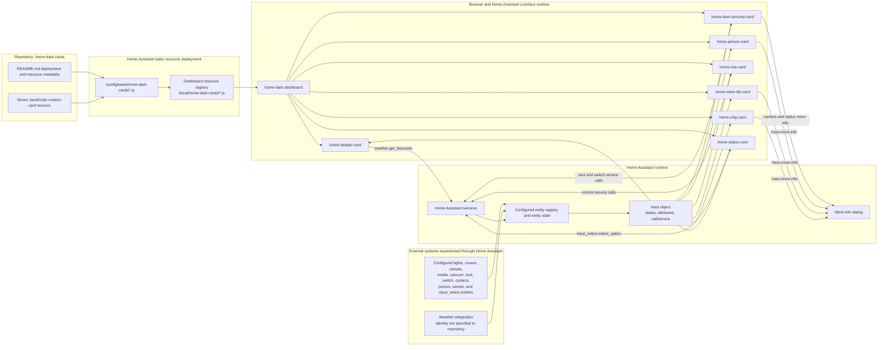

## Project Overview

- **Project Name:** Home Dark Cards
- **Description:** This repository contains seven standalone JavaScript custom cards for the `home-dark` Home Assistant dashboard. The cards are browser-side Web Components that read Home Assistant entity state, render dark-themed dashboard UI, open Home Assistant more-info dialogs, and call Home Assistant services for supported controls. The repository does not contain a conventional application server, database, frontend build, or generated bundle.
- **Main Features:**
  - `home-header-card`: Displays the current time, date, weather condition, temperature, humidity, feels-like temperature, and an optional daily forecast.
  - `home-chip-card`: Displays a compact status chip for a person, lock, light group, or generic entity.
  - `home-room-tile-card`: Displays a room summary with configured room, climate, light, cover, media, and motion indicators.
  - `home-row-card`: Provides single-entity controls for lights, covers, climate entities, media players, vacuums, and a Tesla quick-device summary.
  - `home-person-card`: Displays person presence, avatar, location, optional battery, and optional distance from `zone.home`.
  - `home-door-security-card`: Displays a doorbell camera preview, door and ring status, silent-mode control, lock control, battery text, and an optional lock confirmation dialog.
  - `home-status-card`: Displays house-mode selection and PM2.5, PM10, and optional air-quality metrics.

The repository README identifies these files as local card sources rather than generated build output. It documents deployment to `/config/www/home-dark-cards/` and registration as `/local/home-dark-cards/*.js` module resources in Home Assistant.

---

## Architecture Overview

The project uses a client-side custom-card architecture. Home Assistant loads each JavaScript file as a dashboard resource, registers the corresponding custom element in the browser, and supplies the element with the Home Assistant `hass` object. The element reads `hass.states`, renders its UI, dispatches `hass-more-info` events, and calls Home Assistant services through the supplied API.

- **Design Patterns/Principles:**
  - Native browser Custom Elements implemented with `HTMLElement`.
  - Configuration-driven rendering through each card's `setConfig()` method.
  - Home Assistant Lovelace card lifecycle through `setConfig()`, `hass`, and `getCardSize()`.
  - Event-driven interaction through DOM events, `hass-more-info`, and Home Assistant service calls.
  - Shadow DOM encapsulation is used by `home-person-card`, `home-status-card`, and `home-door-security-card`; the other cards render into their element's light DOM.
  - Responsive layouts use inline CSS media queries.
  - No server-side MVC, REST API server, ORM, message queue, or repository-owned persistence layer is present.

### System Diagram

- **Diagram:**



- **Explanation:**
  - The repository supplies source JavaScript files. The README documents copying them to Home Assistant's `/config/www/home-dark-cards/` directory and registering matching `/local/home-dark-cards/*.js` module URLs.
  - The `home-dark` dashboard loads the registered resources and creates the seven custom elements when their card types are used.
  - Home Assistant supplies the `hass` object. The cards read entity states and attributes from `hass.states`.
  - User interactions either dispatch `hass-more-info` for Home Assistant's more-info dialog or call a Home Assistant service.
  - The header requests daily forecasts with `weather.get_forecasts`. The source supports `hass.callService`; it also contains fallbacks for `hass.callWS` and `hass.connection.sendMessagePromise`.
  - The repository does not identify the concrete vendor integrations behind the configured Home Assistant entities. It documents entity IDs and Home Assistant domains where those values are present.

---

## Front End/Client Side

- **UI**

  This is a Home Assistant Lovelace custom-card set rather than a standalone web application. The cards provide the following UI:

  - **Header:** `home-header-card` renders a clock, localized date, weather icon, temperature, condition, humidity, feels-like temperature, and an optional forecast list. Forecast results are cached in memory and refreshed no more often than every 30 minutes.
  - **Status chip:** `home-chip-card` renders person home/away state, lock state, light-group member count, or generic entity state. A click opens more-info.
  - **Room tile:** `home-room-tile-card` renders the configured room name and icon, climate temperature/humidity, configured domain icons, and an `on` tag when the configured light group is on. A click opens more-info for the light group or climate entity.
  - **Entity row:** `home-row-card` renders:
    - Light toggles and brightness sliders when `supported_color_modes` includes a mode other than `onoff`.
    - Cover position sliders using `current_position`.
    - Climate target-temperature step controls using 0.5-degree increments.
    - Media-player play/pause controls.
    - Vacuum start/return-to-base controls.
    - A Tesla battery/charging summary using the configured battery sensor and charge switch.
  - **Person card:** `home-person-card` renders an avatar, person name, Home/Away location, optional battery percentage, and optional calculated distance from `zone.home`.
  - **Door security card:** `home-door-security-card` renders camera fallback/image UI, ring and door status overlays, silent-mode control, lock status, lock battery text, and a lock/unlock confirmation dialog when configured.
  - **Home status card:** `home-status-card` renders a house-mode `<select>` backed by an `input_select` entity and PM2.5, PM10, and optional air-quality metric buttons. PM2.5 and PM10 quality labels use configurable display thresholds.

  The README records these verified dashboard/entity examples: `weather.openweathermap`, `person.andrei`, `vacuum.roborock`, `sensor.storm_trooper_battery_level`, `switch.storm_trooper_charge`, `light.living_room_all`, `climate.living_room`, `cover.living_room_window_shutter`, `media_player.living_room_soundbar_ma`, `camera.doorbell`, `lock.front_door`, `sensor.front_door_lock_battery`, `switch.doorbell_system_sounds`, `sensor.doorbell_last_doorbell_ring`, `binary_sensor.front_door`, `input_select.house_mode`, `sensor.home_pm2_5`, `sensor.home_pm10`, and `sensor.air_quality_index`.

- **Structure**

  - Each card is a single JavaScript file with its custom element class, configuration validation, state reads, rendering logic, event handlers, and inline CSS.
  - `window.customCards` is initialized when needed and receives card-picker metadata for each card.
  - `home-header-card.js` manages clock refresh and forecast request/cache behavior.
  - `home-chip-card.js` handles compact status variants and more-info events.
  - `home-room-tile-card.js` handles room summary rendering and more-info navigation.
  - `home-row-card.js` handles per-domain controls, pointer-based slider interaction, service calls, and entity more-info.
  - `home-person-card.js` handles Shadow DOM rendering, person validation, optional battery validation, proximity calculation, and accessible button interaction.
  - `home-door-security-card.js` handles Shadow DOM rendering, camera state, lock/silent controls, confirmation dialog state, and keyboard dismissal.
  - `home-status-card.js` handles Shadow DOM rendering, mode options, metric formatting, quality bands, metric more-info, and mode service calls.
  - There is no client-side router, login screen, API gateway, application-wide state store, or separate client service layer in the repository.

---

## Back End/Service Side

- **Bootstrap**

  There is no repository-owned backend server. Bootstrap occurs when Home Assistant loads a JavaScript module resource in the browser. Each file calls `customElements.define(...)` and adds card metadata to `window.customCards`.

- **Contract**

  The cards use the Home Assistant Lovelace custom-card contract:

  - `setConfig(config)`: Receives card configuration and validates required values.
  - `set hass(hass)`: Receives the current Home Assistant runtime object and triggers rendering.
  - `getCardSize()`: Reports card height to Lovelace.
  - `getGridOptions()`: Present in `home-person-card`, `home-status-card`, and `home-door-security-card` to provide sections-grid sizing.
  - `hass-more-info`: A bubbling, composed custom event used to request Home Assistant's more-info dialog.

  The service calls directly evidenced in the source are:

  - `weather.get_forecasts` with daily forecast type.
  - `input_select.select_option`.
  - `light.toggle` and `light.turn_on` with `brightness_pct`.
  - `cover.set_cover_position`.
  - `climate.set_temperature`.
  - `media_player.media_play_pause`.
  - `vacuum.start` and `vacuum.return_to_base`.
  - `lock.lock` and `lock.unlock`.
  - `switch.turn_on` and `switch.turn_off`.

  The header supports Home Assistant service invocation through `hass.callService`, with WebSocket fallbacks for the forecast request. No repository-owned HTTP, REST, GraphQL, gRPC, or WebSocket server endpoint exists.

- **App Layers**

  - **Presentation layer:** Custom-element DOM, `ha-card`, `ha-icon`, Shadow DOM where used, and inline CSS.
  - **State access layer:** Small per-card helpers read `hass.states[entity_id]` and selected state attributes.
  - **Interaction layer:** DOM listeners translate clicks, pointer gestures, keyboard input, and dialog actions into more-info events or Home Assistant service calls.
  - **Persistence/data-access layer:** Not implemented in the repository. Entity state and service execution remain in Home Assistant.

- **Infra**

  Shared runtime capabilities are supplied by Home Assistant's frontend: `ha-card`, `ha-icon`, `hass.states`, `hass.callService`, and more-info event handling. The repository contains no package manifest, compiler, bundler, server configuration, database client, environment loader, logging framework, or third-party utility module.

- **3rd Parties**

  - **Home Assistant Frontend:** Loads the resources, supplies Lovelace lifecycle APIs and the `hass` object, renders `ha-card`/`ha-icon`, and executes service calls.
  - **Home Assistant weather service:** The header requests `weather.get_forecasts`; the repository does not identify the underlying weather vendor.
  - **Material Design Icons through Home Assistant:** The cards use `mdi:*` icon names through Home Assistant's `<ha-icon>` element. No separate icon package is included in this repository.
  - **HACS:** The README explicitly states that HACS resources are not included in this folder.

---

## Technology Stack

The versions below are limited to values explicitly recorded in repository files.

- **Frontend:**
  - Frameworks/Libraries: Native browser Custom Elements and Home Assistant Lovelace custom-card APIs. No JavaScript framework or library package is declared.
  - Language: JavaScript. No language/runtime version is specified in repository files.
  - Styling: Inline CSS in each card, including responsive media queries and CSS custom properties where used.
  - State Management: Home Assistant's supplied `hass` object and `hass.states`; no separate state-management library is present.

- **Backend:**
  - Language/Framework: No backend language or server framework is present.
  - API: Home Assistant Lovelace card lifecycle and Home Assistant service APIs supplied to the browser.

- **Database:**
  - Primary Database: [Information not found in codebase]
  - Cache: No external cache is present. `home-header-card` uses an in-memory forecast cache with a 30-minute refresh interval.

- **Other Tools & Services:**
  - Containerization: [Information not found in codebase]
  - Message Queue: [Information not found in codebase]
  - Search: [Information not found in codebase]
  - CI/CD: [Information not found in codebase]
  - Home Assistant Core: `2026.7.4`, recorded in the README export metadata.
  - Deployment path: `/config/www/home-dark-cards/`, recorded in the README.
  - Registered resource URL prefix: `/local/home-dark-cards/`, recorded in the README.

---

## Project Structure

The committed repository snapshot contains the following application files:

```plaintext
home-dark-cards/
├── README.md                    # Export metadata, card configuration examples, deployment instructions
├── home-header-card.js          # Clock, weather, metrics, and optional forecast card
├── home-chip-card.js            # Person, lock, light-group, and generic status chip
├── home-room-tile-card.js       # Room summary tile
├── home-row-card.js             # Light, cover, climate, media, vacuum, and Tesla rows
├── home-person-card.js          # Person presence, battery, and proximity card
├── home-door-security-card.js   # Doorbell, door status, silent mode, and lock card
├── home-status-card.js           # House mode and air-quality status card
└── ai-overview.md               # Repository architecture and onboarding overview
```

No `src/`, `components/`, `pages/`, `services/`, `utils/`, `tests/`, `scripts/`, `docs/`, package manifest, lockfile, Dockerfile, or GitHub workflow is present in the committed file tree.

The README records these Home Assistant dashboard resource IDs:

| File | Card type | Resource ID |
|---|---|---|
| `home-header-card.js` | `home-header-card` | `f5ede969d4124ec89d4e76d2d2f4ecca` |
| `home-chip-card.js` | `home-chip-card` | `e9296b183aed49a7ba6c3a7af8cfdd81` |
| `home-room-tile-card.js` | `home-room-tile-card` | `02af4e539e264967a4c8b7079075876e` |
| `home-row-card.js` | `home-row-card` | `840736a3a49340b59f4d314a3cf80ef2` |
| `home-person-card.js` | `home-person-card` | `d655ab1709e94df7be303b4504d5397c` |
| `home-door-security-card.js` | `home-door-security-card` | `fdf4fcf92eee4a61805911ed6fc8a781` |
| `home-status-card.js` | `home-status-card` | `aa8e713224b14feab81eb6aa0586560d` |

---

## Environment Configurations

- **Environments:**
  - Development: [Information not found in codebase]
  - Staging: [Information not found in codebase]
  - Production: [Information not found in codebase]

- **Configuration Management:**
  - Card configuration is supplied by Home Assistant dashboard YAML when each custom card is instantiated.
  - The repository contains no `.env` files, `.env.example`, configuration schema file, or environment-variable loader.
  - The README documents Home Assistant resource registration and dashboard card configuration as the installation configuration.

- **Setup Instructions for local development:**
  1. No local package installation or build command is documented.
  2. Copy a card JavaScript file to `/config/www/home-dark-cards/<card-file>.js` in the Home Assistant installation.
  3. Register `/local/home-dark-cards/<card-file>.js` as a module dashboard resource.
  4. In the `home-dark` dashboard editor, add a manual card and paste the card's YAML configuration.
  5. Save the dashboard and hard-refresh the browser after a new or updated resource.

  The README states that the repository does not copy files to Home Assistant or change the remote dashboard automatically.

---

## Security

- **Authentication:** [Information not found in codebase]. The card source contains no login, token storage, credential handling, or authentication implementation. It relies on the Home Assistant dashboard runtime for access to `hass` and service APIs.
- **Authorization:** [Information not found in codebase]. The source validates required configuration values and, for house mode, verifies that a selected option is present in the entity's exposed options. It does not define user roles or permission rules.
- **Data Encryption:** [Information not found in codebase]. The repository does not configure transport encryption or encryption at rest.
- **Security Tools:** [Information not found in codebase]. There is no security middleware, dependency configuration, rate limiter, or security scanning workflow in the repository.
- **UI safety controls present in source:** The door security card can require confirmation for both lock and unlock actions through `confirm_lock_actions`; the dialog supports Cancel, Escape, and backdrop dismissal. The person card validates person and sensor entity prefixes, and the status card restricts mode selection to options exposed by the `input_select` entity.

---

## Deployment

- **Deployment Process:**
  1. Copy the selected JavaScript source file to `/config/www/home-dark-cards/`.
  2. Register or update the matching `/local/home-dark-cards/<card-file>.js` module resource in Home Assistant.
  3. Add or update the corresponding manual card configuration in the `home-dark` dashboard editor.
  4. Save the dashboard and hard-refresh the browser when the resource is new or changed.

  The README identifies the Home Assistant dashboard resource API and the `user-hass` MCP tool as ways to register or update a live resource. The repository itself does not automate deployment.

- **CI/CD Pipeline:** [Information not found in codebase]. No GitHub Actions workflow or other pipeline configuration is present.
- **Tools Used:**
  - Home Assistant static file directory: `/config/www/home-dark-cards/`.
  - Home Assistant module resource URLs: `/local/home-dark-cards/*.js`.
  - Home Assistant dashboard resource API or the documented `user-hass` MCP tool.
  - Deployment scripts: [Information not found in codebase]

---

## Testing

- **Testing Frameworks:**
  - Unit Testing: [Information not found in codebase]
  - Integration Testing: [Information not found in codebase]
  - End-to-End Testing: [Information not found in codebase]

- **Running Tests:**
  - Unit/Integration: [Information not found in codebase]
  - E2E: [Information not found in codebase]

- **Test Coverage:** [Information not found in codebase]. The repository contains no test files, test configuration, coverage configuration, or coverage report.

---

## UI Framework

- **Framework/Library:** Native browser Web Components implemented with `HTMLElement`; the cards follow the Home Assistant Lovelace custom-card lifecycle.
- **Component Library:** Home Assistant frontend elements `ha-card` and `ha-icon`.
- **Styling:** Inline CSS embedded in each JavaScript source file. The cards use dark color palettes, rounded cards/pills, responsive media queries, focus-visible outlines, and CSS custom properties in the person card.
- **External UI package:** [Information not found in codebase]. No React, Vue, Angular, Lit, Material UI, Tailwind, or other package dependency is declared.

---

## Shared Utilities and Helpers

- **Utilities:**
  - There is no shared utility module. Similar helper methods are implemented independently inside cards:
    - `_st`, `_state`, or equivalent methods read an entity state.
    - `_attr` or `_attribute` reads an entity attribute.
    - `_more` or `_moreInfo` dispatches `hass-more-info`.
    - `_call` wraps `hass.callService` in `home-row-card`.
    - Formatting helpers convert temperatures, timestamps, quality values, and relative times for display.
  - `home-header-card.js` contains the only explicit reusable in-card cache: its forecast cache is held in the element instance and refreshed at most every 30 minutes.

- **Helpers:**
  - `home-row-card.js`: `_lightDimmable`, `_updateSliderFromPointer`, and `_commitSlider` implement brightness/position slider behavior.
  - `home-person-card.js`: `_distanceKm` computes distance from person coordinates to `zone.home`; `_text` escapes displayed text for HTML.
  - `home-status-card.js`: `_quality` applies configured PM2.5/PM10 display bands; `_selectMode` validates and calls `input_select.select_option`.
  - `home-door-security-card.js`: `_controlLock`, `_openLockDialog`, and `_finishLock` implement guarded lock actions.

- **Examples:**

```javascript
// Repeated Home Assistant more-info event pattern used by the cards.
this.dispatchEvent(new CustomEvent('hass-more-info', {
  detail: { entityId: entity },
  bubbles: true,
  composed: true
}));
```

The cards do not export a shared JavaScript API. Each file defines its own custom element and registers its own card-picker metadata through `window.customCards`.

---

## Important Notes

- The repository README records seven JavaScript resources. It states that six of the seven are currently referenced by the `home-dark` dashboard and that `home-chip-card` is registered but has no current card instance.
- The README export metadata records Home Assistant Core `2026.7.4` and an export time of `2026-08-01 21:20 (UTC+03:00)`.
- `home-status-card.js` is described as a local source file registered as a `/local/` resource rather than one of the six original inline-content exports.
- `home-door-security-card` accepts `lock_label`, but the source uses literal `Front door` text for lock titles and confirmation text. Changing `lock_label` therefore has no visible effect in the current source.
- `home-door-security-card` accepts `confirm_unlock`, but `confirm_lock_actions` is the current option that controls confirmation for both lock and unlock operations.
- `home-chip-card` uses an entity's `entity_id` attribute to count light-group members when that attribute is available.
- `home-row-card` determines whether a light is dimmable from `supported_color_modes`; it does not display a brightness slider for an `onoff`-only light.
- At the time this overview was generated, the Git worktree marked `README.md` and all seven JavaScript source files as deleted relative to `HEAD`. Those deletions were preserved as requested; this document was created without restoring or modifying those files. The documented source details come from the committed repository snapshot.
- The repository does not confirm the Home Assistant instance's complete dashboard configuration, concrete vendor integrations, deployment credentials, network topology, environment separation, or runtime permissions. Those details require manual verification.

---

### Maintenance Note

Update this document whenever a card file, card configuration contract, Home Assistant resource ID or URL, deployment path, supported service call, or documented dashboard usage changes. Keep versions and operational details limited to facts recorded in the repository or verified from the target Home Assistant instance.
